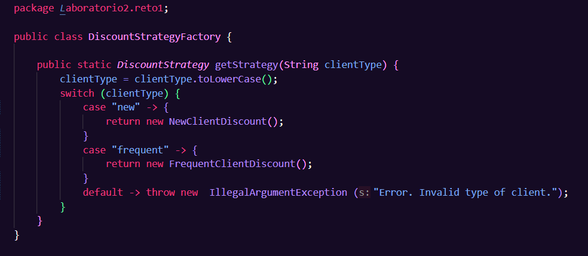
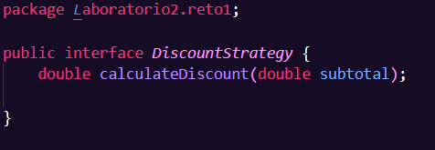
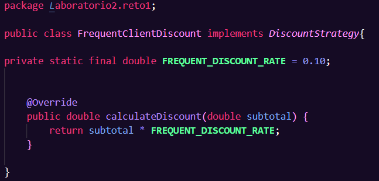
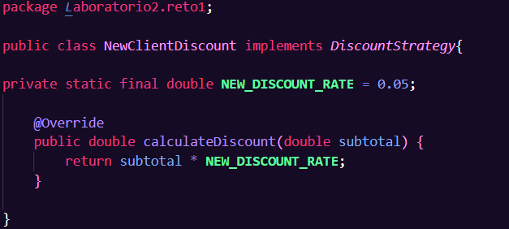
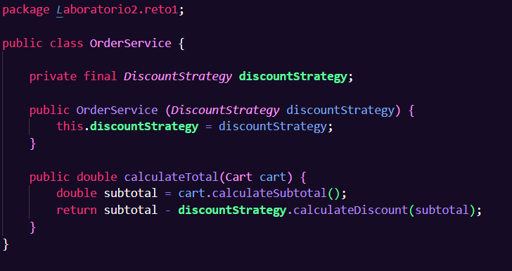
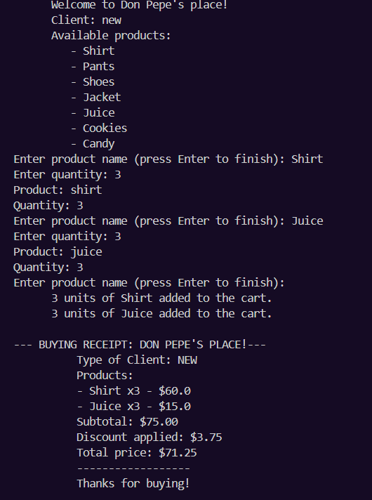
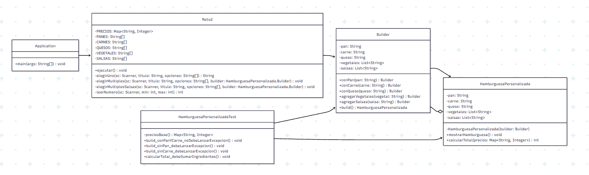
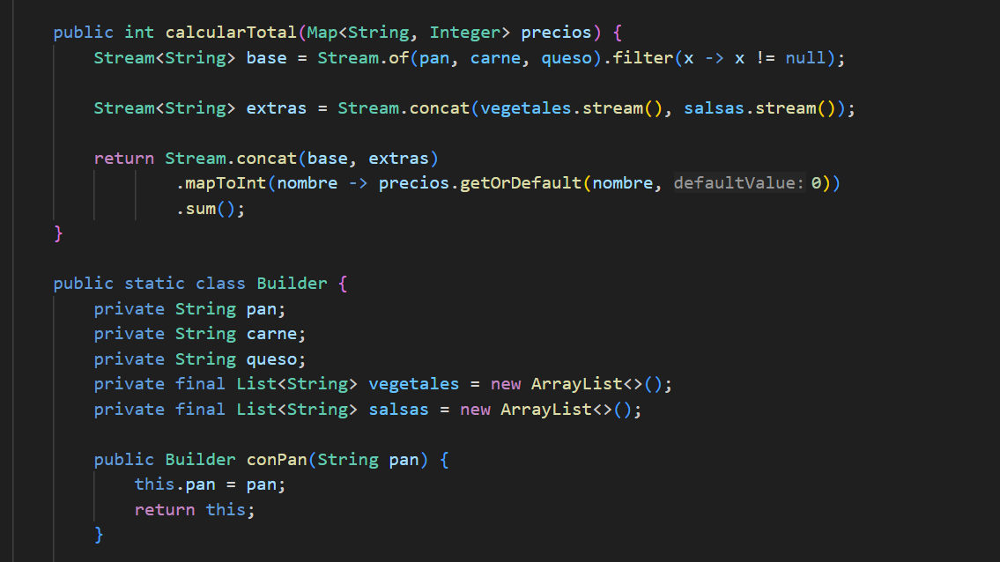

# Laboratorio 2 - Identificando los patrones de diseño 
**Autoras: Paula Valentina Lozano, Ángela Gómez**

## RETO 1 - El problema de la tienda de Don Pepe – Patrón comportamental 

**Diagrama de clases**

Diagrama de clases realizado en Mermaid: 

Nota: El diagrama fue apoyado del código UML brindado por ChatGPT. 

**Descripción**

Consideramos que para este problema podría ser óptimo el uso del patrón de Strategy, ya que en esta situación se requiere implementar tipos de clientes; acá podríamos implementar interfaces para facilitar el manejo de los productos de la tienda de Pepe, en donde cambiamos el algoritmo durante el tiempo de ejecución. 

Para empezar, se crearon las clases principales para el ejercicio, como Cart, Product, Client y CartItem. Después de esto empezamos a organizar las siguientes clases para aplicarle el patrón de Strategy: creamos DiscountStrategy, el cual es una interface muy puntual con el método para calcular el descuento. La clase DiscountStrategyFactory se encarga de instanciar las clases concretas que implementan la interfaz DiscountStrategy y devolverlas como dicho tipo. Para esto creamos clases llamadas NewClientDiscount y FrequentClientDiscount, las cuales guardan la tasa de descuento para su tipo de cliente. 

A continuación se muestran algunas de las clases que fueron esenciales para la aplicación del patrón Strategy con una clase del patrón Factory para facilitar el manejo de los tipos de clientes con sus respectivos descuentos. Mientras el Strategy se usa por tipo de descuento, el Factory se usa como un patrón secundario para decidir qué tipo de Strategy usar dependiendo del cliente y así evitar el uso de if else en el Main. 

Ahora bien, teniendo estas clases en cuenta, el "flujo" entre esas clases es el siguiente:

Client -> DiscountStrategyFactory -> DiscountStrategy  -> FrequentClientDiscount v NewClientDiscount

Así logramos organizar de forma práctica los algoritmos que se deben realizar para cada tipo de cliente, en donde Factory encapsula los diferentes Strategies, uno por tipo de discuento por cliente.

Si analizamos la forma en la que desarrollamos el ejercicio, acá estamos aplicando conceptos como polimorfismo, responsabilidad única y Open/Closed principle, pues estamos usando interfaces de tal forma que si llega a ver un nuevo tipo de cliente, simplemente se añade ese nueva clase y se le agrega esa línea en DiscountStrategyFactory para poder instanciar dicho objeto del nuevo tipo del cliente. 

En adición, calculos restantes se realizan en la clase de OrderService:

Finalmente, en el Main logramos la impresión y recolección de todos los resultados, productos, cálculos, tipos de cliente, entre otros. 

Un ejemplo de entrada y salida es el siguiente.

### Ejemplo: 

## RETO 2 - El chef de 5 estrellas – Patrón creacional 

**Diagrama de clases**

**Descripción**
Para este problema identificamos que el mejor patrón de diseño para manejar la creación de hamburguesas es el Builder: esto se debe a que, por el contexto de la creación de las hamburguesas, este patrón nos ofrece un rango de posibles opciones para los pedidos de los usuarios – es decir, con este patrón logramos resultados personalizados. 

**Patrón de Diseño**

Creacional

**Patrón Utilizado**

Builder

**Justificación**

Para este problema identificamos que el patrón más adecuado para manejar la creación de hamburguesas personalizadas es el Builder, ya que el reto exige construir objetos complejos paso a paso, permitiendo que algunos ingredientes sean opcionales.

Cada hamburguesa puede tener pan, carne, queso, vegetales y salsas, pero no todos los ingredientes son obligatorios ni siempre se combinan de la misma manera. Si hubiéramos utilizado un constructor tradicional con muchos parámetros, el código habría sido difícil de leer, mantener y extender. Además, se habría vuelto poco claro cuáles ingredientes son obligatorios y cuáles opcionales.

El patrón Builder nos permitió separar el proceso de construcción del objeto final, dando flexibilidad para que el usuario elija únicamente los ingredientes que desea, sin afectar la coherencia del objeto resultante.

**Aplicación**

Implementamos la clase HamburguesaPersonalizada, la cual contiene los atributos correspondientes a los ingredientes seleccionados. Dentro de esta clase definimos un Builder interno que permite agregar ingredientes de manera progresiva mediante métodos encadenados.

Cada método del builder agrega un ingrediente específico y retorna la misma instancia del builder, lo que permite una construcción fluida hasta que finalmente se llama al método build(), que genera la hamburguesa completa.

De esta forma:

 - El usuario selecciona los ingredientes.

 - El builder construye el objeto paso a paso.

 - La hamburguesa final queda completamente configurada antes de utilizarse.

El cálculo del precio total se realizó utilizando streams, sumando dinámicamente el valor de los ingredientes seleccionados. Esto nos permitió mantener el código limpio y funcional.

El desarrollo se realizó en equipo, distribuyendo responsabilidades entre los integrantes para garantizar que todos participáramos activamente en la implementación. Para reforzar la comprensión del patrón Builder nos apoyamos en material visto en clase y algunos recursos adicionales como videos explicativos.

La estructuración del flujo principal y la organización del método main se apoyó parcialmente con herramientas de IA para mantener claridad y evitar que se volviera demasiado extenso, siempre revisando y comprendiendo el código antes de integrarlo.

